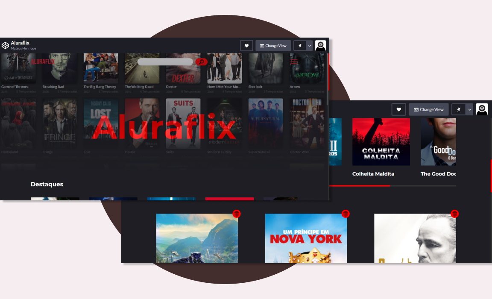

# Aluraflix

## Tabela de conteúdo

- [Sobre](#Sobre)
  - [Links](#links)
  - [Screenshot](#screenshot)
- [Tecnologias](#tecnologias)
- [Autor](#autor)

## Sobre

Projeto construido durante a imersão dev da alura, nele é possivel adicionar, remover, e listar filmes ou series por categorias, os conteúdos adicionados se mantem salvo no navegador do usuario. Para adicionar basta clicar no menu hamburguer no canto superior direito e escolher o que deseja fazer.

### Screenshot

### Links

- Live Site URL: (https://codepen.io/mateus-henrique-the-decoder/full/gOgPOQv)

### Tecnologias

- Tags semânticas de HTML5
- CSS propriedades comuns
- Flexbox
- CSS Grid
- Javascript puro

## Autor

- Site - (https://www.mateushenriquedev.ml)
